# LiDAR Visualization Pipeline - Phase Documentation

## Pipeline Overview

This streamlined LiDAR processing pipeline transforms raw point cloud data into web-accessible visualizations through five key phases. The pipeline emphasizes automated processing, direct web accessibility, and efficient resource management within existing infrastructure.

## What is Potree?

Potree is an open-source WebGL-based point cloud renderer for large datasets, originally developed by Markus Schütz. It enables interactive visualization of massive LiDAR point clouds directly in web browsers without requiring specialized software installation.

### Key Technical Features

- **Octree-based LOD**: Hierarchical Level-of-Detail system for efficient rendering of billion+ point datasets
- **WebGL Rendering**: GPU-accelerated visualization with adaptive point sizing and materials
- **Streaming Architecture**: Progressive loading of point data based on viewer position and zoom level
- **Format Support**: Optimized binary formats (.bin) with spatial indexing for web delivery
- **Cross-Platform**: Works on any device with WebGL support (desktop, mobile, tablets)

### Potree vs. Traditional Point Cloud Software

- **No Installation**: Browser-based access eliminates desktop software requirements
- **Collaborative**: Shareable URLs enable team collaboration and public access
- **Scalable**: Handles datasets from millions to billions of points efficiently
- **Interactive**: Real-time navigation, measurement tools, and classification filtering

---

## Phase 1: Processing Submission & Conversion

**Objective**: Convert raw LAS files into web-optimized point cloud formats using Tapis platform orchestration.


### Key Activities

#### Job Submission

- **User Action**: Submit Potree Converter Cookbook to Tapis platform
- **Parameters Specified**:
  - Input LAS file path in Corral storage
  - Output web directory location
  - Converter settings and optimization parameters

#### Data Processing Workflow

```
Tapis Platform → Read LAS files from Corral Storage
Tapis Platform → Execute Potree Converter v2.1.1
Potree Converter → Process point cloud data through multiple steps:
    1. Parse LAS structure and metadata
    2. Build spatial octree hierarchy
    3. Generate web-optimized tiles
    4. Create scene.json5 configuration file
```

#### Iterative Processing

- **Level of Detail Generation**: Creates multiple resolution levels for adaptive rendering
- **Octree Hierarchy**: Builds spatial data structure for efficient visualization
- **Web Optimization**: Generates tiles optimized for browser-based streaming

#### Output Generation

**Generated Files**:

- `cloud.js` - Main octree structure file
- `hierarchy.bin` - Spatial hierarchy data
- `*.bin` files - Point data at various detail levels
- `scene.json5` - Scene configuration
- `metadata.json` - Processing and spatial metadata

#### Critical Infrastructure Step

- **Data Accessibility**: Files moved to web-accessible folder within Corral
- **Direct Access**: Ensures processed data can be served directly without additional transfers
- **Performance Optimization**: Eliminates need for external data movement

### Outcomes

- Raw LAS data transformed into web-ready format
- All files accessible via web URLs
- Processing completion notification sent to user
- Data ready for immediate cataloging and visualization

---

## Phase 2: CKAN Registration & Cataloging

**Objective**: Register processed point cloud data as discoverable resources in the CKAN data portal with integrated scene configuration management.

```mermaid
%%{ init : { "theme" : "neutral", "themeVariables" : { "primaryColor" : "#fff", "primaryTextColor" : "#000", "primaryBorderColor" : "#000", "lineColor" : "#000", "secondaryColor" : "#f8f8f8", "tertiaryColor" : "#f0f0f0" }}}%%
sequenceDiagram
    participant User as 👤 User/Researcher
    participant CKAN as 📚 CKAN Portal
    participant PotreePlugin as 🌐 Potree CKAN-Plugin

    %% CKAN Registration Phase
    rect rgb(230, 245, 255)
        Note over User,PotreePlugin: Phase 2: CKAN Registration & Cataloging
        User->>CKAN: Register and upload scene.json5 resource
        Note right of User: Upload configuration:<br/>- scene.json5 file<br/>- Local file or remote URL

        CKAN->>CKAN: Store scene.json5 as CKAN resource
        Note right of CKAN: Resource metadata:<br/>- Format: JSON5<br/>- Resource ID<br/>- Name and description<br/>- Access permissions

        CKAN->>CKAN: Generate viewer URL with resource ID
        Note right of CKAN: URL format:<br/>https://target-server/dataset/potree/<CKAN_RESOURCE_ID>

        User->>CKAN: Access integrated viewer link
        CKAN->>PotreePlugin: Redirect to viewer with resource_id
        PotreePlugin->>CKAN: Fetch scene.json5 via CKAN API
        CKAN-->>PotreePlugin: Return scene configuration data
        PotreePlugin->>PotreePlugin: Parse JSON5 and validate permissions
        PotreePlugin-->>User: Serve Potree viewer with scene data
    end

```



### Key Activities

#### Resource Registration with Integrated Viewer

- **User Action**: Register new resource in CKAN portal
- **Primary Asset**: Upload Potree scene.json5 configuration file (local upload or remote URL)
- **Resource Type**: CKAN recognizes and categorizes as Potree visualization
- **Direct Integration**: CKAN generates viewer URLs that directly load the scene configuration

#### CKAN Resource Management

- **Automatic Detection**: CKAN identifies scene.json5 as Potree configuration
- **Resource Storage**: Scene configurations stored as standard CKAN resources
- **Permission Integration**: Leverages CKAN's built-in access control and permissions
- **Version Control**: Benefits from CKAN's resource versioning capabilities

#### Integrated Viewer Architecture

**PotreePlugin-CKAN Integration**:

- **Resource ID Parameter**: Viewer URLs include CKAN resource ID for direct access
- **API Integration**: PotreePlugin app fetches scene data directly from CKAN API
- **Permission Validation**: Ensures user has appropriate access to view/edit resources
- **Bidirectional Sync**: Changes in viewer can be saved back to CKAN resource

#### URL Structure & Access Pattern

**Generated URLs**:

```
http://ckan.tacc.cloud:5000/dataset/potree/60f27f0c-1d75-4578-a622-25d6dea44073
```

**Data Flow**:

1. CKAN stores scene.json5 as resource
2. User clicks viewer link from CKAN
3. PotreePlugin app fetches scene data from CKAN API
4. Potree viewer loads with configuration
5. User modifications saved back to CKAN resource

### Outcomes

- Seamless integration between CKAN catalog and Potree viewer
- Single source of truth for scene configurations in CKAN
- Leverages existing CKAN permissions and access control
- Bidirectional data flow enables collaborative editing
- Direct viewer access from CKAN resource pages

---

## Phase 3: Discovery & Access

**Objective**: Enable users to find, evaluate, and access point cloud visualizations through the integrated CKAN-Potree interface.

```mermaid
%%{ init : { "theme" : "neutral", "themeVariables" : { "primaryColor" : "#fff", "primaryTextColor" : "#000", "primaryBorderColor" : "#000", "lineColor" : "#000", "secondaryColor" : "#f8f8f8", "tertiaryColor" : "#f0f0f0" }}}%%
sequenceDiagram
    participant User as 👤 User/Researcher
    participant CKAN as 📚 CKAN Portal
    participant PotreePlugin as 🌐 Potree CKAN-Plugin
    participant Corral as 💾 Corral Storage

    %% Discovery & Access Phase
    rect rgb(230, 245, 255)
        Note over User,Corral: Phase 3: Discovery & Access
        User->>CKAN: Search for point clouds
        Note right of User: Search criteria:<br/>- Geographic region<br/>- Classification types<br/>- Date range<br/>- Keywords

        CKAN-->>User: Return search results
        Note left of CKAN: Results include:<br/>- Dataset previews<br/>- Metadata summary<br/>- Integrated viewer links<br/>- Resource previews

        User->>CKAN: Select scene.json5 resource
        Note right of User: One-click access from<br/>CKAN resource page

        User->>PotreePlugin: Click "View in Potree" button
        Note right of User: URL: /dataset/potree/<ID>

        PotreePlugin->>CKAN: Fetch scene.json5 via API
        CKAN-->>PotreePlugin: Return scene configuration

        PotreePlugin->>PotreePlugin: Parse JSON5 and validate access
        Note right of PotreePlugin: Security checks:<br/>- User permissions<br/>- Resource access<br/>- Path validation

        PotreePlugin->>Corral: Load point cloud data
        Note right of PotreePlugin: Based on scene config:<br/>- Local files or URLs<br/>- Direct web-accessible paths

        PotreePlugin-->>User: Serve integrated Potree viewer
        Note left of PotreePlugin: Complete viewer with:<br/>- Scene configuration<br/>- Point cloud data<br/>- Interactive tools
    end
```



### Key Activities

#### Enhanced Data Discovery

- **CKAN Search Interface**: Users query using enhanced criteria
- **Search Parameters**:
  - Geographic region and spatial extent
  - Point cloud classification types
  - Date ranges and collection periods
  - Keywords and technical metadata
  - Resource format filters (scene.json5)

#### Integrated Results Presentation

**CKAN Enhanced Features**:

- **Resource Previews**: Built-in preview capabilities for scene.json5 files
- **Metadata Summary**: Auto-extracted spatial and technical information
- **Direct Viewer Access**: "View in Potree" buttons on resource pages
- **Seamless Integration**: No external redirects or complex URL construction

#### One-Click Visualization Access

- **Resource Page Integration**: Direct viewer links from CKAN resource pages
- **Automatic Configuration**: Scene settings automatically loaded from CKAN
- **Permission Inheritance**: User access rights carried over from CKAN
- **No Manual Setup**: Zero configuration required from users

#### Technical Implementation Benefits

- **Unified Authentication**: Single login for both CKAN and viewer
- **API-Driven Access**: Real-time data fetching via CKAN API
- **Security Integration**: Leverages CKAN's permission system
- **Performance Optimization**: Direct serving of point cloud data from storage

### Outcomes

- Streamlined discovery workflow within familiar CKAN interface
- One-click access to interactive 3D visualizations
- Integrated user experience with unified authentication
- Reduced complexity for end users
- Enhanced metadata-driven search capabilities

---

## Phase 4: Integrated Visualization

**Objective**: Provide seamless 3D point cloud visualization with CKAN-integrated data management and analysis capabilities.

```mermaid
%%{ init : { "theme" : "neutral", "themeVariables" : { "primaryColor" : "#fff", "primaryTextColor" : "#000", "primaryBorderColor" : "#000", "lineColor" : "#000", "secondaryColor" : "#f8f8f8", "tertiaryColor" : "#f0f0f0" }}}%%
sequenceDiagram
    participant User as 👤 User/Researcher
    participant Browser as 🌍 Browser/Client
    participant PotreePlugin as 🌐 Potree CKAN-Plugin
    participant CKAN as 📚 CKAN Portal
    participant Corral as 💾 Corral Storage

    %% Visualization Phase
    rect rgb(230, 245, 255)
        Note over User,Corral: Phase 4: Integrated Visualization
        User->>Browser: Access viewer via CKAN
        Browser->>PotreePlugin: Load Potree CKAN-Pluginlication

        PotreePlugin->>CKAN: Fetch scene.json5 via API
        Note right of PotreePlugin: Resource ID from URL<br/>parameters
        CKAN-->>PotreePlugin: Return scene configuration

        PotreePlugin->>PotreePlugin: Parse configuration and validate permissions
        Note right of PotreePlugin: Security checks:<br/>- User permissions<br/>- Resource access<br/>- Path validation

        PotreePlugin-->>Browser: Serve Potree viewer to browser
        Note left of PotreePlugin: Complete viewer with<br/>scene configuration

        Browser->>Corral: Request point cloud data and octree tiles
        Note right of Browser: Direct requests based on<br/>scene config paths
        Corral-->>Browser: Return octree tiles

        Browser->>Browser: Adaptive loading based on user navigation
        Note right of Browser: LOD system loads data<br/>as needed for viewport

        Browser->>Browser: Real-time 3D rendering with WebGL acceleration
        Note over Browser: Enhanced features:<br/>- GPU-accelerated rendering<br/>- Interactive navigation<br/>- Measurement tools<br/>- Classification filtering

        User->>Browser: Make annotations/measurements
        Browser->>PotreePlugin: Save modifications
        PotreePlugin->>CKAN: Update scene.json5 resource
        CKAN-->>PotreePlugin: Confirm save
        PotreePlugin-->>Browser: Confirm changes saved
    end
```



### Key Activities

#### Integrated Viewer Loading

- **PotreePlugin Application**: Serves complete Potree viewer with CKAN integration
- **Resource-Based Configuration**: Scene settings automatically loaded from CKAN resource
- **Authentication Continuity**: User sessions maintained across CKAN and viewer
- **Dynamic Configuration**: Real-time scene data fetching via CKAN API

#### Enhanced Data Streaming & Rendering

```
PotreePlugin App → Fetch scene.json5 from CKAN API
PotreePlugin App → Parse configuration and validate permissions
PotreePlugin App → Serve Potree viewer to browser
Browser → Request point cloud data and octree tiles from Corral storage
Browser → Adaptive loading based on user navigation
Browser → Real-time 3D rendering with WebGL acceleration
```

**Important Disclaimer**: The octree data (point clouds and tiles) must be publicly accessible via web URLs. In this architecture, the octree files are not stored within CKAN but remain in Corral storage with public web access. Only the scene.json5 configuration file is stored as a CKAN resource.

#### Advanced Interactive Capabilities

**Core Features**:

- **3D Navigation**: Pan, zoom, rotate with multiple camera modes and saved viewpoints
- **Measurement Tools**: Distance, area, volume, and height calculations with persistent storage
- **Classification Filters**: Dynamic point cloud filtering and visualization controls
- **Export Options**: Screenshot capture, data subset downloads, and scene configuration export

**CKAN Integration Features**:

- **Persistent Annotations**: User annotations and measurements saved to CKAN resource
- **Collaborative Editing**: Multiple users can contribute to scene configurations
- **Version Control**: Scene modifications tracked through CKAN's versioning system
- **Shareable Links**: Stable URLs for specific scene configurations and viewpoints

#### Bidirectional Data Flow

- **Save to CKAN**: User modifications automatically sync back to CKAN resource
- **Real-time Updates**: Changes reflected immediately in CKAN resource metadata
- **Permission Preservation**: Write access controlled by CKAN resource permissions
- **Conflict Resolution**: Version control prevents conflicting simultaneous edits

### Outcomes

- Seamless integration between visualization and data management
- Persistent collaborative analysis capabilities
- Enhanced metadata and annotation management
- Professional-grade analysis tools with cloud storage
- Zero software installation requirements with full functionality

---

## Phase 5: Advanced Collaboration & Knowledge Sharing

**Objective**: Enable sophisticated team collaboration, persistent analysis workflows, and professional knowledge sharing through integrated CKAN-Potree capabilities.

```mermaid
%%{ init : { "theme" : "neutral", "themeVariables" : { "primaryColor" : "#fff", "primaryTextColor" : "#000", "primaryBorderColor" : "#000", "lineColor" : "#000", "secondaryColor" : "#f8f8f8", "tertiaryColor" : "#f0f0f0" }}}%%
sequenceDiagram
    participant UserA as 👤 Researcher A
    participant UserB as 👤 Researcher B
    participant Browser as 🌍 Browser/Client
    participant PotreePlugin as 🌐 Potree CKAN-Plugin
    participant CKAN as 📚 CKAN Portal

    %% Collaboration & Sharing
    rect rgb(230, 245, 255)
        Note over UserA,CKAN: Phase 5: Advanced Collaboration & Knowledge Sharing

        UserA->>Browser: Create annotations/measurements
        Browser->>PotreePlugin: Save modifications
        PotreePlugin->>CKAN: Update scene.json5 resource
        Note right of CKAN: Real-time saves:<br/>- Annotations<br/>- Measurements<br/>- View configurations<br/>- Analysis notes

        UserA->>CKAN: Share resource with UserB
        Note right of UserA: CKAN permission system:<br/>- Read access<br/>- Edit access<br/>- Organization sharing

        CKAN->>UserB: Notify of shared resource
        UserB->>CKAN: Access shared resource
        UserB->>PotreePlugin: Open in Potree viewer
        PotreePlugin->>CKAN: Load latest scene configuration
        CKAN-->>PotreePlugin: Return updated scene data
        PotreePlugin-->>UserB: Display collaborative workspace

        UserB->>Browser: Add additional analysis
        Browser->>PotreePlugin: Save collaborative changes
        PotreePlugin->>CKAN: Update shared resource
        Note right of CKAN: Version tracking:<br/>- Change history<br/>- Contributor tracking<br/>- Conflict resolution

        UserA->>CKAN: Review collaborative updates
        Note left of UserA: Persistent collaboration<br/>via stable CKAN URLs
    end
```



### Key Activities

#### Advanced Collaborative Analysis

- **Multi-user Workflows**: Multiple researchers can contribute to same scene analysis
- **Professional Documentation**: Rich annotation system for research documentation
- **Analysis Persistence**: All work automatically saved and versioned in CKAN

#### CKAN-Integrated Data Management

**Collaborative Features**:

- **Permission-Based Sharing**: Leverages CKAN's sophisticated access control
- **Organization Workflows**: Team-based resource management within CKAN organizations

**Professional Sharing Capabilities**:

- **Publication-Ready Links**: Stable CKAN URLs for citations and references
- **Metadata Integration**: Rich dataset descriptions with spatial and technical metadata

#### Enhanced Persistence & Continuity

**Saved Information Architecture**:

- **Spatial Annotations**: 3D markers with rich text, links, and multimedia attachments
- **Quantitative Measurements**: Precise calculations with units, uncertainty, and context
- **View Configurations**: Camera positions, rendering settings, and visualization states
- **Analysis Workflows**: Complete research session documentation and methodology

---

## Technical Architecture Benefits

### Infrastructure Efficiency

- **Separated Concerns**: Processing and serving infrastructure optimized independently
- **Scalable Deployment**: Multiple target servers can host the same datasets
- **Cost Optimization**: Efficient resource utilization across pipeline stages

### User Experience

- **Fast Access**: Local data serving provides optimal performance
- **Reliable URLs**: Stable links for bookmarking and sharing
- **No Dependencies**: Browser-based access without software installation
- **Cross-Platform**: Consistent experience across devices and operating systems

### Data Management

- **FAIR Compliance**: Findable, Accessible, Interoperable, Reusable data
- **Standardized Formats**: scene.json5 configuration enables consistent metadata
- **Automated Workflows**: Minimal manual intervention required
- **Quality Control**: Validation and verification throughout pipeline

### Research Impact

- **Enhanced Discovery**: Rich metadata enables precise dataset finding
- **Collaborative Analysis**: Shared URLs facilitate team research
- **Educational Value**: Accessible visualizations support teaching and outreach
